# Geetest v4 自动化解决方案

本项目是一个结合了深度学习与自动化流程的工具，用于处理极验（Geetest）v4 的文字点选验证码。它使用 **YOLOv8** 模型进行目标检测，并集成了 **TrOCR** 和 **PaddleOCR** 模型进行文字识别，提供了灵活的配置选项。

## 主要功能

- **多模式验证**: 支持全自动 (`auto`)、纯手动 (`manual`) 模式，并内置了基于失败率的自动降级切换逻辑。自动模式可灵活配置使用 TrOCR 或 PaddleOCR 引擎。
- **模型生命周期管理**:
  - **YOLOv8**: 提供从数据准备、增强到模型训练、评估和导出的全套 `ultralytics` 工具链。
  - **TrOCR**: 提供数据集构建、模型微调和识别测试功能。
  - **PaddleOCR**: 提供数据集构建、模型微调和识别测试功能。
- **半自动数据准备**: 内置 `extract_text_regions` 工具，可使用已训练的YOLO模型自动裁剪文字区域，为 OCR 模型训练准备数据。
- **命令行模型覆盖**: `run` 命令支持通过命令行参数直接指定 YOLO 和 OCR 模型路径，无需修改配置文件。
- **模块化设计**: 代码经过重构，结构清晰，易于维护和扩展。
- **统一配置**: 所有配置项集中于 `config/settings.py`，通过 `dataclass` 进行结构化管理。
- **命令行接口**: 提供强大的 `main.py` CLI 入口，支持所有核心功能。

## 项目结构

```
Geetest4_yolov8/
│
├── config/
│   ├── __init__.py
│   ├── paddle_ocr_template.yml # PaddleOCR训练配置模板
│   └── settings.py             # 唯一的项目配置文件
│
├── core/
│   ├── __init__.py
│   ├── captcha_processor.py    # 核心处理器，整合所有逻辑
│   ├── gt4.py                  # 极验v4底层API交互
│   ├── manual_fallback.py      # 人工验证GUI函数
│   ├── paddle_recognizer.py    # PaddleOCR文字识别函数
│   ├── trocr_recognizer.py     # TrOCR文字识别函数
│   └── yolo_inference.py       # YOLOv8推理函数
│
├── data/                       # 数据根目录 (详细结构见下方说明)
│   ├── dataset/                # 处理后数据集 (YOLO, PaddleOCR, TrOCR)
│   ├── models/                 # 训练好的模型文件
│   └── raw/                    # 原始数据
│
├── docs/                       # 项目文档
│
├── libs/                       # 第三方库和子模块
│   ├── ppocr/                  # PaddleOCR相关代码
│   └── tools/                  # 其他工具代码
│
├── logs/                       # 日志文件
│
├── training/
│   ├── __init__.py
│   ├── data_collector.py       # 数据收集函数
│   ├── dataset_preparation.py  # 数据集准备与增强函数
│   ├── semi_auto_labeler.py    # 半自动标注工具
│   ├── synthetic_data_generator.py # 合成数据生成器
│   ├── text_extractor.py       # 文字区域提取与TrOCR数据准备
│   ├── train_paddleocr.py      # PaddleOCR模型训练函数
│   ├── train_trocr.py          # TrOCR模型训练函数
│   └── train_yolo.py           # YOLO模型训练与验证函数
│
├── main.py                     # 主程序入口
├── README.md
└── requirements.txt            # Python依赖包列表
```

## 快速开始

### 1. 运行验证码处理器

默认情况下，`run` 命令会使用 `config/settings.py` 中配置的 YOLO 和 OCR 模型。您也可以通过命令行参数临时覆盖这些模型配置。

- **在自动模式下运行 (使用默认配置)**：
  ```bash
  python3 main.py run --mode auto
  ```
- **在自动模式下运行 (使用自定义模型)**：
  ```bash
  # 使用指定的YOLO模型和TrOCR模型
  python3 main.py run --mode auto \
      --yolo-model "data/models/my_custom_yolo.pt" \
      --ocr-engine trocr \
      --trocr-model "runs/trocr_train/my_trained_trocr"

  # 使用指定的YOLO模型和PaddleOCR模型
  python3 main.py run --mode auto \
      --yolo-model "data/models/my_custom_yolo.pt" \
      --ocr-engine paddle \
      --paddle-model-dir "runs/paddle_train/my_trained_paddle_inference"
  ```
- **在手动模式下运行 (会弹出GUI窗口)**：
  ```bash
  python3 main.py run --mode manual
  ```

### 2. 准备YOLO数据集
从包含图片和 `.txt` 标签的原始数据文件夹创建YOLOv8格式的数据集：
```bash
python3 main.py prepare --source "path/to/raw_data" --output "data/dataset/yolo"
```

### 3. 训练YOLO模型
使用准备好的YOLO数据集训练一个新模型：
```bash
python3 main.py train --data "data/dataset/yolo/dataset.yaml" --epochs 100
```

### 4. 半自动数据准备与OCR工作流

项目支持为 TrOCR 和 PaddleOCR 准备训练数据。

- **文字区域提取 (`extract_text_regions`)**: 使用 YOLO 模型自动裁剪文字图片，为 OCR 模型准备数据：
  ```bash
  python3 main.py extract_text_regions --yolo-model "data/models/best.pt" --input-dir "data/raw/images" --output-dir "data/dataset/trocr"
  ```
- **训练 TrOCR 模型**: (需要先标注裁剪出的图片或使用 `text_extractor` 自动标注)
  ```bash
  python3 main.py train_trocr --dataset-dir "data/dataset/trocr"
  ```
- **训练 PaddleOCR 模型**: (需要准备 PaddleOCR 格式的标签文件)
  ```bash
  python3 main.py train_paddle \
      --train-label-file "data/dataset/paddle/rec_gt_train.txt" \
      --val-label-file "data/dataset/paddle/rec_gt_val.txt"
  ```
> **注意**: 更多命令和详细说明，请查阅 `docs/` 目录下的文档，特别是 **[使用说明 (usage.md)](./docs/usage.md)**。

## 各模块作用说明

- **`config/`**: 项目的配置中心。
  - `settings.py`: 唯一的配置中心，通过 `dataclass` 定义了所有可调参数。
  - `paddle_ocr_template.yml`: PaddleOCR 训练的 YAML 配置文件模板，在训练时会被动态填充。

- **`core/`**: 核心业务逻辑。
  - `captcha_processor.py`: 项目的“大脑”，整合了验证流程、模式切换和错误管理，并协调 YOLO 和 OCR 模型的调用。
  - `gt4.py`: 封装了与极验v4后端的底层网络请求和加密逻辑。
  - `yolo_inference.py`: 提供加载YOLOv8模型和执行推理的函数。
  - `manual_fallback.py`: 提供一个Tkinter GUI界面，用于人工手动验证。
  - `trocr_recognizer.py`: 提供加载和使用TrOCR模型进行文字识别的函数。
  - `paddle_recognizer.py`: 提供加载和使用PaddleOCR模型进行文字识别的函数。

- **`data/`**: 统一的数据存储目录。

- **`libs/`**: 第三方库和子模块，例如 `ppocr` 等。

- **`logs/`**: 日志文件存储目录。

- **`training/`**: 模型训练生命周期管理。
  - `data_collector.py`: 提供用于收集新训练数据的函数。
  - `dataset_preparation.py`: 包含从原始数据到YOLO格式数据集的完整处理流程。
  - `semi_auto_labeler.py`: 半自动标注工具，为裁剪出的文字图片添加标签。
  - `synthetic_data_generator.py`: 生成用于 TrOCR 训练的合成验证码图像。
  - `text_extractor.py`: 智能脚本，从图片中提取文字区域，并为 TrOCR 训练准备数据集。
  - `train_paddleocr.py`: 封装了 PaddleOCR 模型的训练。
  - `train_trocr.py`: 封装了 TrOCR 模型的微调训练。
  - `train_yolo.py`: 封装了 YOLO 模型的训练、验证和导出。

- **`utils/`**: 无状态的通用工具函数 (图像处理、坐标转换等)。

## 流程示意图

