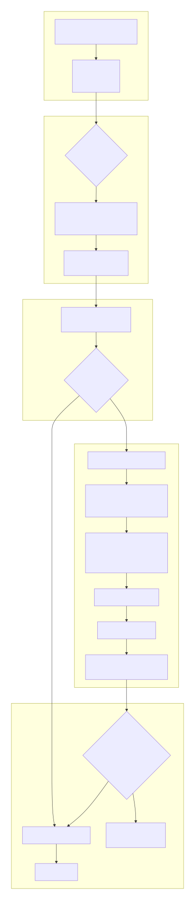

# Geetest v4 自动化解决方案

本项目是一个结合了深度学习与自动化流程的工具，用于处理极验（Geetest）v4 的文字点选验证码。它使用 **YOLOv8** 模型进行目标检测，并集成了 **TrOCR** 和 **PaddleOCR** 模型进行文字识别，提供了灵活的配置和强大的混合匹配策略。

## 主要功能

- **智能多模式验证**:
  - 支持全自动 (`auto`)、纯手动 (`manual`) 模式，并内置基于失败率的自动降级切换逻辑。
  - **OCR引擎配置泛化**: 自动模式可灵活配置使用 TrOCR 或 PaddleOCR 引擎，并为不同引擎动态加载对应的置信度阈值，无需手动修改代码。
- **高级混合匹配策略**:
  - 优先使用 OCR 进行快速文本匹配。当文本匹配未能完全解决所有字符时，无缝切换到**全局高级匹配模式**。
  - 该模式引入了强大的 **ImageMatcher**，它结合 **GrabCut** 前景分割、**minAreaRect** 文字方向校正及多角度旋转，极大增强了对复杂背景和旋转字符的识别鲁棒性。
  - 利用 **匈牙利算法** 实现所有待选文字和所有检测区域之间的全局最优匹配，确保即使在 OCR 识别失败或 YOLO 检测不准的情况下，也能通过图像相似度找到最佳解决方案。
- **完整的模型生命周期管理**:
  - **YOLOv8**: 提供从数据准备、增强到模型训练、评估和导出的全套 `ultralytics` 工具链。
  - **TrOCR & PaddleOCR**: 提供数据集构建、模型微调和识别测试功能。
- **高效的数据准备工具**:
  - `extract_text_regions`: 使用已训练的 YOLO 模型自动裁剪文字区域，为 OCR 模型训练准备数据。
  - `semi_auto_labeler.py`: 半自动标注工具。
  - `synthetic_data_generator.py`: 合成数据生成器。
- **灵活的配置与命令行**:
  - 所有配置项集中于 `config/settings.py`，通过 `dataclass` 进行结构化管理。
  - `run` 命令支持通过命令行参数直接指定 YOLO 和 OCR 模型路径，无需修改配置文件。
  - 提供强大的 `main.py` CLI 入口，支持所有核心功能。

## 项目结构

```
Geetest4_yolov8/
│
├── config/
│   ├── paddle_ocr_template.yml # PaddleOCR训练配置模板
│   └── settings.py             # 唯一的项目配置文件
│
├── core/
│   ├── captcha_processor.py    # 核心处理器，整合所有逻辑
│   ├── gt4.py                  # 极验v4底层API交互
│   ├── manual_fallback.py      # 人工验证GUI函数
│   ├── matcher.py              # 高级图像匹配器 (GrabCut, minAreaRect, Hungarian)
│   ├── paddle_recognizer.py    # PaddleOCR文字识别封装
│   ├── trocr_recognizer.py     # TrOCR文字识别封装
│   └── yolo_inference.py       # YOLOv8推理封装
│
├── data/                       # 数据根目录
│   ├── dataset/                # 处理后数据集 (YOLO, PaddleOCR, TrOCR)
│   ├── models/                 # 训练好的模型文件
│   └── raw/                    # 原始数据
│
├── docs/                       # 项目文档
│
├── libs/                       # 第三方库和子模块 (如 ppocr)
│
├── logs/                       # 日志与调试图片输出
│
├── training/
│   ├── data_collector.py       # 数据收集
│   ├── dataset_preparation.py  # 数据集准备与增强
│   ├── run_matching.py         # [测试] ImageMatcher匹配测试脚本
│   ├── semi_auto_labeler.py    # 半自动标注工具
│   ├── synthetic_data_generator.py # 合成数据生成器
│   ├── text_extractor.py       # 文字区域提取
│   ├── train_paddleocr.py      # PaddleOCR模型训练
│   ├── train_trocr.py          # TrOCR模型训练
│   └── train_yolo.py           # YOLO模型训练
│
├── main.py                     # 主程序入口
├── README.md
└── requirements.txt            # Python依赖包列表
```

## 快速开始

### 1. 运行验证码处理器

默认情况下，`run` 命令会使用 `config/settings.py` 中配置的模型。

- **在自动模式下运行 (使用默认配置)**：
  ```bash
  python3 main.py run --mode auto
  ```
- **在自动模式下运行 (使用自定义模型)**：
  ```bash
  # 使用指定的YOLO模型和TrOCR模型
  python3 main.py run --mode auto \
      --yolo-model "data/models/my_custom_yolo.pt" \
      --ocr-engine trocr \
      --trocr-model "runs/trocr_train/my_trained_trocr"
  ```
- **在手动模式下运行 (会弹出GUI窗口)**：
  ```bash
  python3 main.py run --mode manual
  ```

### 2. 模型训练

- **准备YOLO数据集**:
  ```bash
  python3 main.py prepare --source "path/to/your_raw_data" --output "data/dataset/yolo"
  ```
- **训练YOLO模型**:
  ```bash
  python3 main.py train --data "data/dataset/yolo/dataset.yaml" --epochs 100
  ```
- **准备OCR数据集**:
  ```bash
  python3 main.py extract_text_regions --yolo-model "data/models/best.pt" --input-dir "data/raw/images" --output-dir "data/dataset/trocr"
  ```
> **注意**: 更多训练命令和详细说明，请查阅 `docs/` 目录下的文档。

### 3. 测试 (开发者)

项目提供了独立的匹配测试脚本，用于调试 `ImageMatcher` 的功能。

- **运行基础匹配测试** (一对一匹配):
  ```bash
  python3 -m training.run_matching simple
  ```
- **运行高级匹配测试** (多对多, GrabCut + 匈牙利算法):
  ```bash
  python3 -m training.run_matching advanced
  ```
  > 在运行高级测试前，请确保已在 `training/run_matching.py` 中配置了正确的测试图片路径。

## 各模块作用说明

- **`config/`**: 项目的配置中心。
  - `settings.py`: 唯一的配置中心，通过 `dataclass` 定义了所有可调参数。

- **`core/`**: 核心业务逻辑。
  - `captcha_processor.py`: 项目的“大脑”，整合了验证流程、模式切换和错误管理。实现了文本匹配与全局高级图像匹配的混合策略。
  - `gt4.py`: 封装了与极验v4后端的底层网络请求和加密逻辑。
  - `manual_fallback.py`: 提供一个Tkinter GUI界面，用于人工手动验证。
  - `matcher.py`: 实现 `ImageMatcher` 类，用于图像特征提取和相似度匹配。包含针对复杂背景字符的 GrabCut 分割、minAreaRect 校正、多角度旋转及匈牙利算法匹配等高级功能。
  - `paddle_recognizer.py`: 封装了 PaddleOCR 模型，提供统一的识别接口。
  - `trocr_recognizer.py`: 封装了 TrOCR 模型，提供统一的识别接口。
  - `yolo_inference.py`: 封装了 YOLOv8 模型的加载和推理。

- **`training/`**: 模型训练与数据处理的生命周期管理。
  - `data_collector.py`: 提供用于收集新训练数据的函数。
  - `dataset_preparation.py`: 包含从原始数据到YOLO格式数据集的完整处理流程。
  - `run_matching.py`: 用于独立测试 `ImageMatcher` 功能的脚本。
  - `semi_auto_labeler.py`: 半自动标注工具。
  - `synthetic_data_generator.py`: 生成用于 TrOCR 训练的合成验证码图像。
  - `text_extractor.py`: 智能脚本，从图片中提取文字区域。
  - `train_paddleocr.py`: 封装了 PaddleOCR 模型的训练。
  - `train_trocr.py`: 封装了 TrOCR 模型的微调训练。
  - `train_yolo.py`: 封装了 YOLO 模型的训练、验证和导出。

- **`utils/`**: 无状态的通用工具函数 (如图像处理、坐标转换等)。

## 流程示意图


